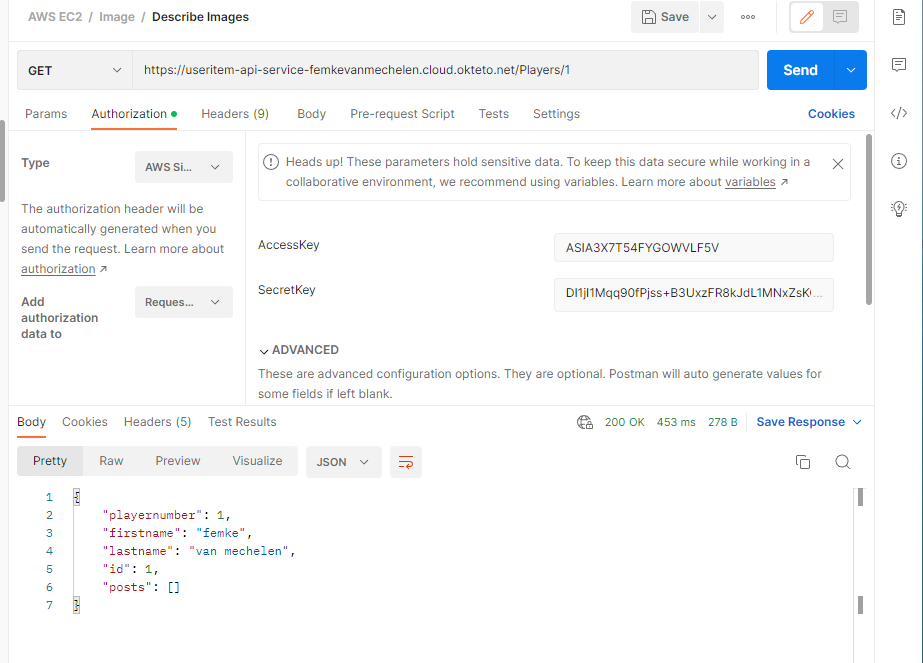

# Project-API

**Beschrijving:**

Voor dit project heb ik het onderwerp 'Rode Duivels' gekozen. Men kan een speler van de Rode Duivels toevoegen, inlezen en verwijderen met een DELETE. Ook heb ik gebruik gemaakt van posts waardoor ik een voor elke speler een post kan maken waardoor ik extra informatie over die speler kan meegeven. Deze posts kunnen ook bijgewerkt worden door middel van een PUT en kunnen verwijderd worden door middel van een DELETE.

