# Project-API

**Beschrijving:**

Voor dit project heb ik het onderwerp 'Rode Duivels' gekozen. Men kan een speler van de Rode Duivels toevoegen, inlezen en verwijderen met een DELETE. Ook heb ik gebruik gemaakt van posts waardoor ik een voor elke speler een post kan maken waardoor ik extra informatie over die speler kan meegeven. Deze posts kunnen ook bijgewerkt worden door middel van een PUT en kunnen verwijderd worden door middel van een DELETE.

**Beschrijving API:**

Ik heb gebruik gemaakt van 2 POSTS (1 om spelers aan te maken en 1 om posts aan te maken over die spelers), ook heb ik 2 DELETES aangemaakt( 1 om spelers te kunnen verwijderen en 1 om POSTS van die spelers te kunnen verwijderen), daarnaast heb ik 4 GETS (1 om alle spelers te lezen, 1 om spelers op ID te lezen, 1 om alle posts te lezen en 1 om posts van een id te lezen) en als laatste heb ik er ook nog een PUT aan toegevoegd. Deze kan posts op ID updaten.

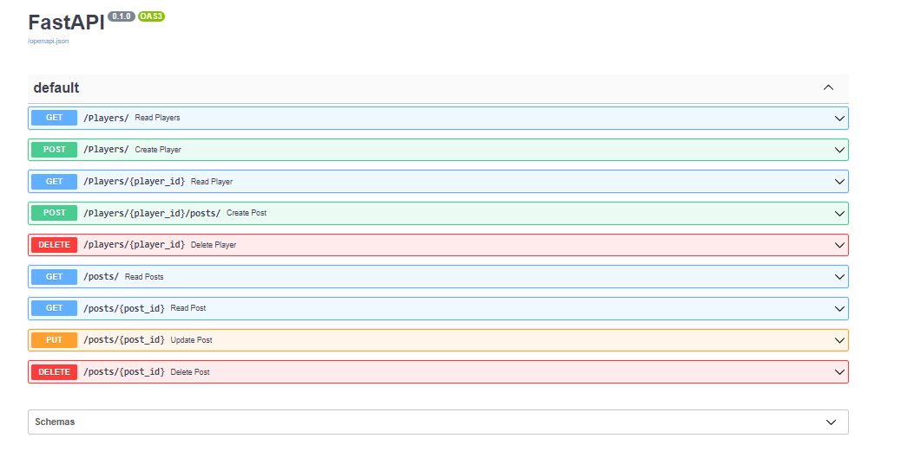

**Beschrijving front-end:**

Op mijn front-end heb ik 2 gets en 1 post gezet. Ik heb 1 GET om alle spelers op te vragen en 1 GET om alle posts van die spelers op te vragen. Ook heb ik op mijn front-end een post gezet om een speler van de Rode Duivels aan te maken.

Foto:

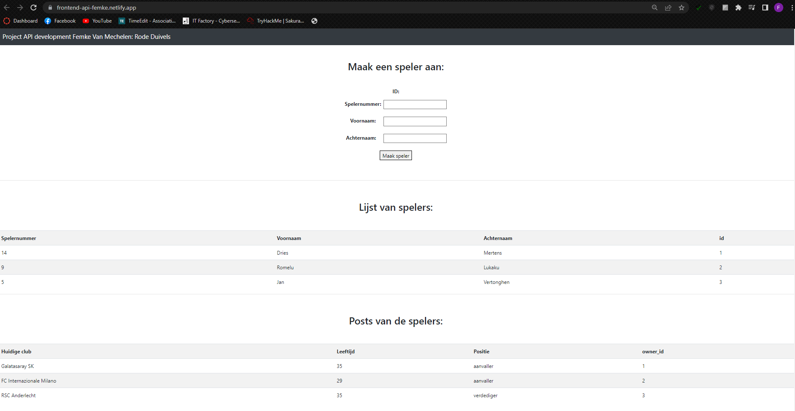

**Link naar frond-end Github Repository:**

https://github.com/femkevm/frontend-api

**Link naar hosted front-end:**

https://frontend-api-femke.netlify.app/

**Werking API door screenshots van Postman:**
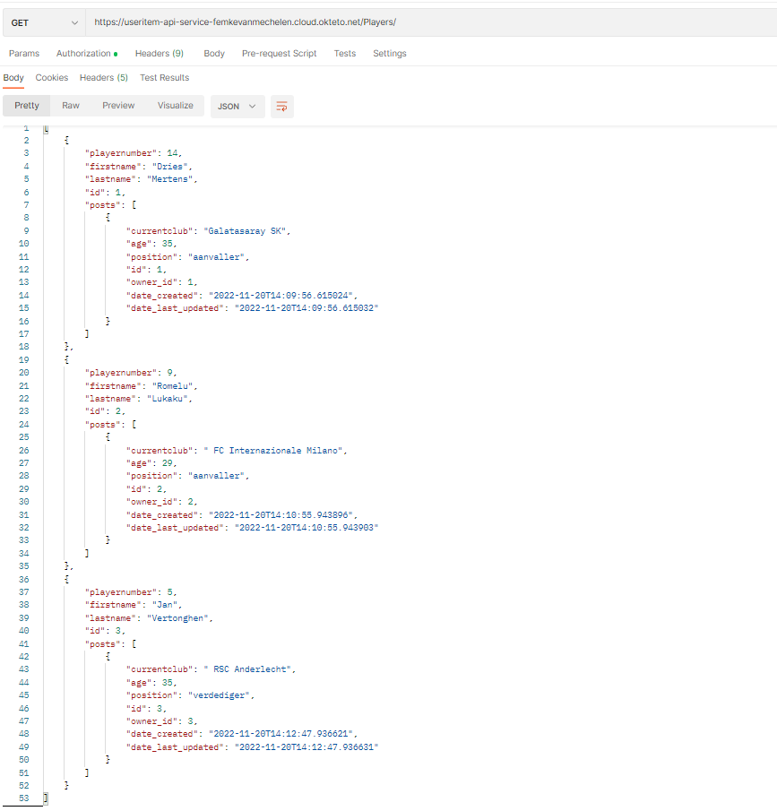
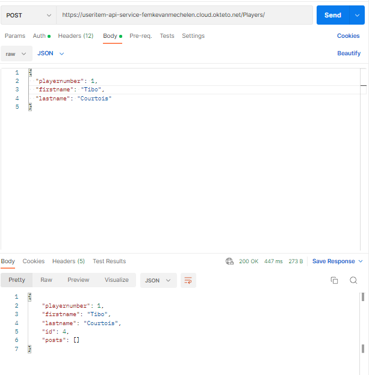

**OpenAPI docs screenshots:**
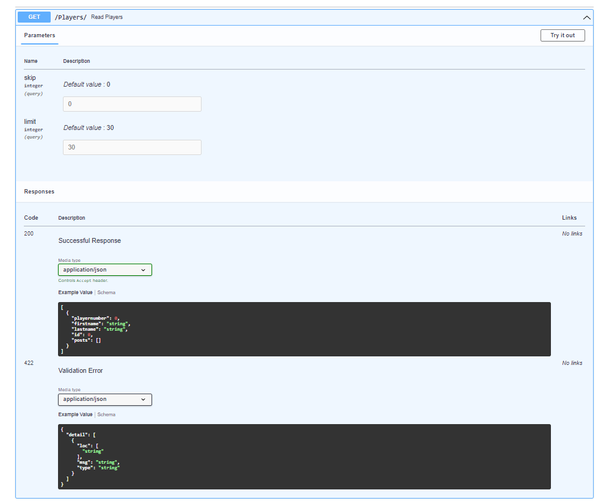
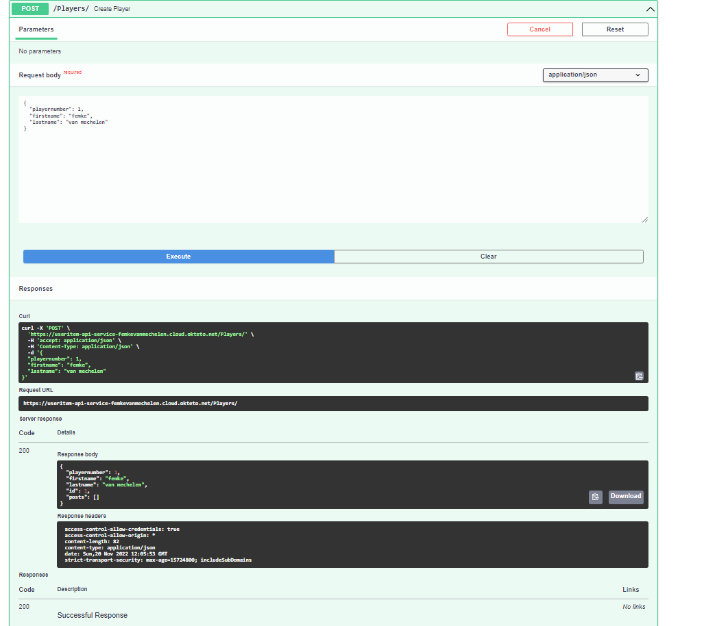
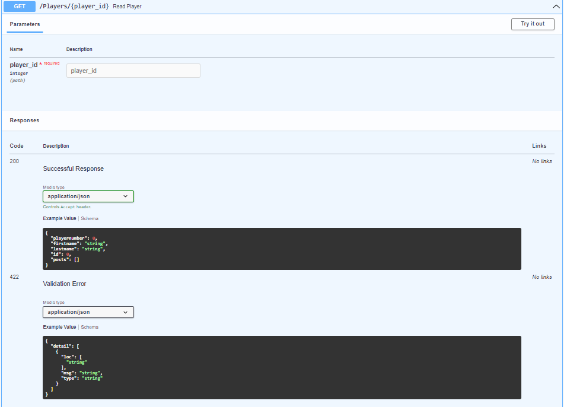
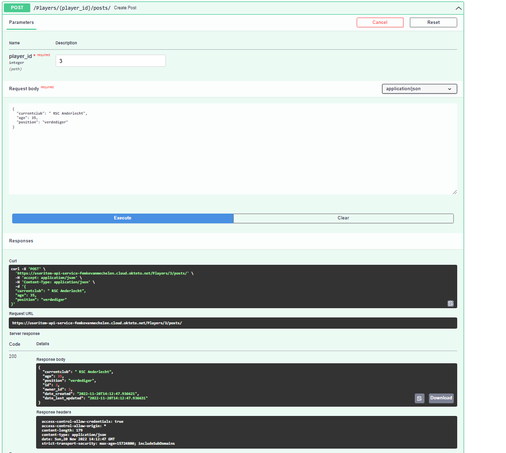
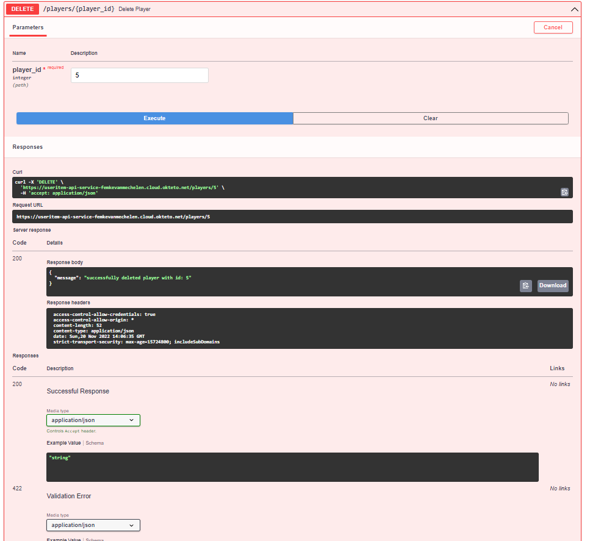
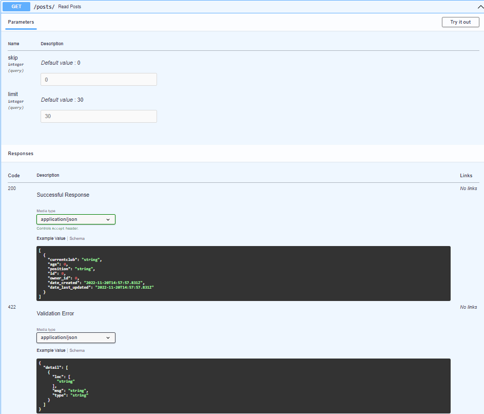
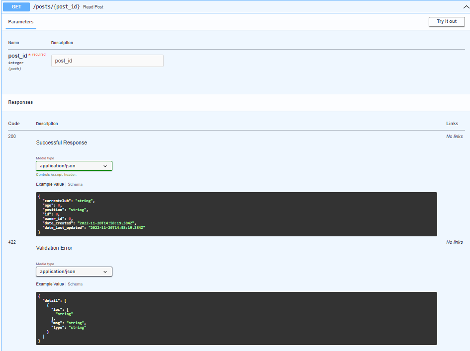
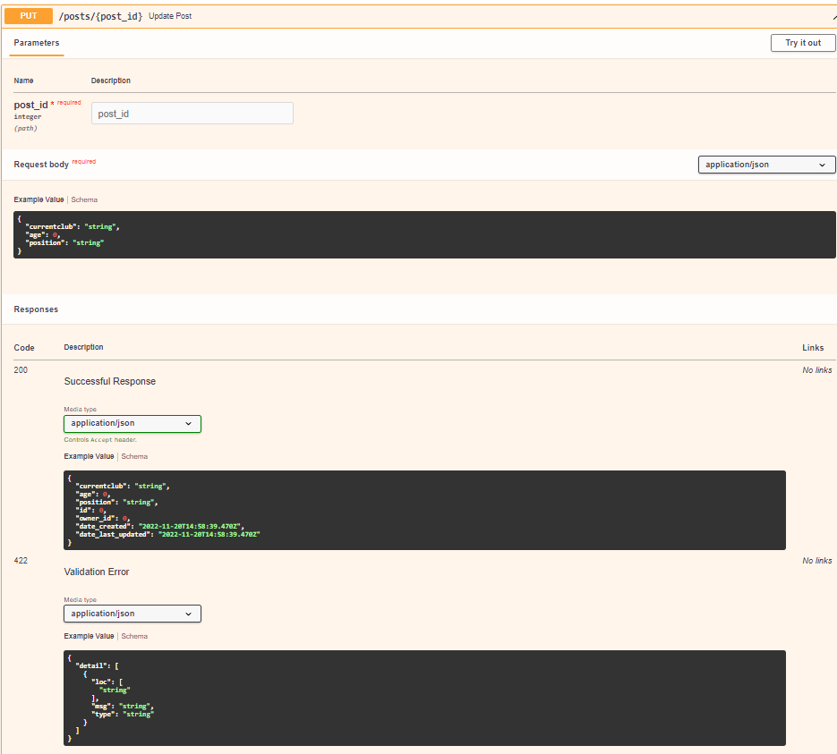
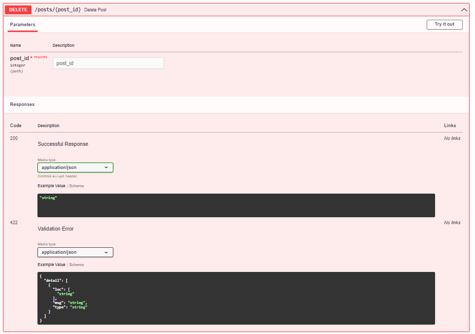

**Youtube video werking:**

